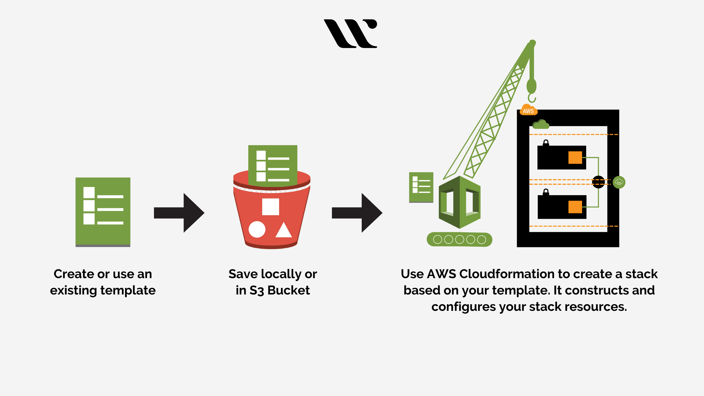

#### Definition

**CloudFormation** is an **Infrastructure as Code (IaC)** service offered by Amazon Web Services (AWS). It allows you to define and manage your entire AWS infrastructure using human-readable templates written in JSON or YAML format.

#### Benifits

- **Reduced complexity**: Manage your infrastructure in a declarative way, focusing on what you want to achieve rather than how.
- **Improved efficiency**: Automate deployments and avoid manual configuration errors.
- **Increased consistency**: Ensure all deployments adhere to the defined infrastructure configuration.
- **Enhanced collaboration**: Share and collaborate on infrastructure definitions through version control.
- **Simplified scaling**: Easily scale your infrastructure up or down based on needs.
